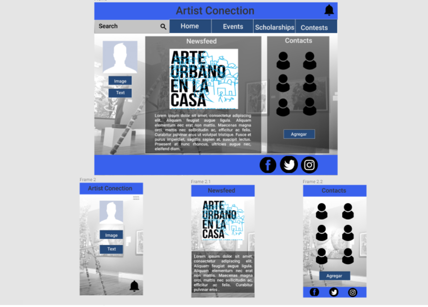

MI RED SOCIAL
*** ARTIST CONECTION ***

El objetivo de este proyecto, es crear una red social en donde las personas interesadas en actividades y noticias relacionadas con el medio artístico y cultural, puedan compartir y concentrar información de las diferentes convocatorias, eventos y demás actividades de las que puedan estar interesados.

Creando una comunidad de amigos que interactúan con esta información es posible contar con información actualizada, periódica y variada concentrada en un mismo lugar.

Resultado de una investigación previa se ha estructurado esta red con la finalidad de que la información proporcionada sea la de mayor importancia y funcionalidad para los usuarios.

Como objetivos a largo plazo se considera incluir una agenda personalizada con un sistema de notificaciones para informar sobre el cierre de convocatorias para enviar proyectos y crear.

